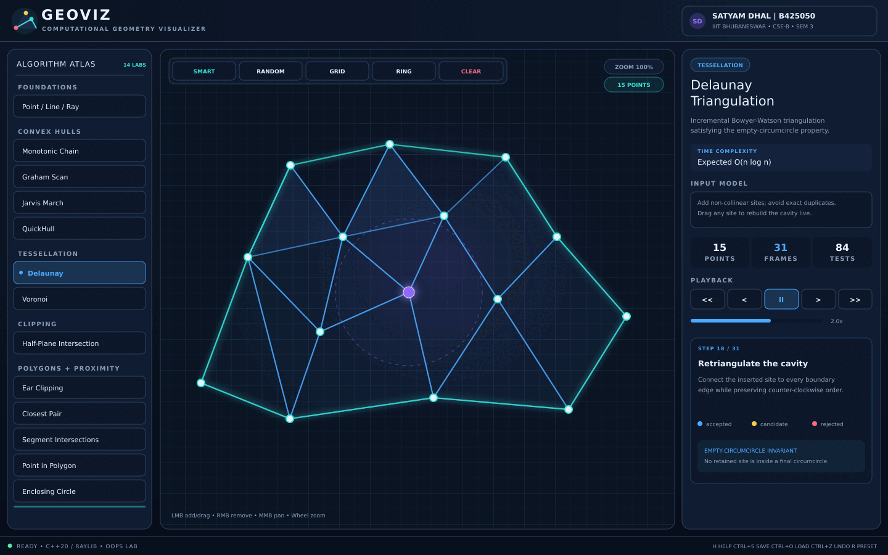
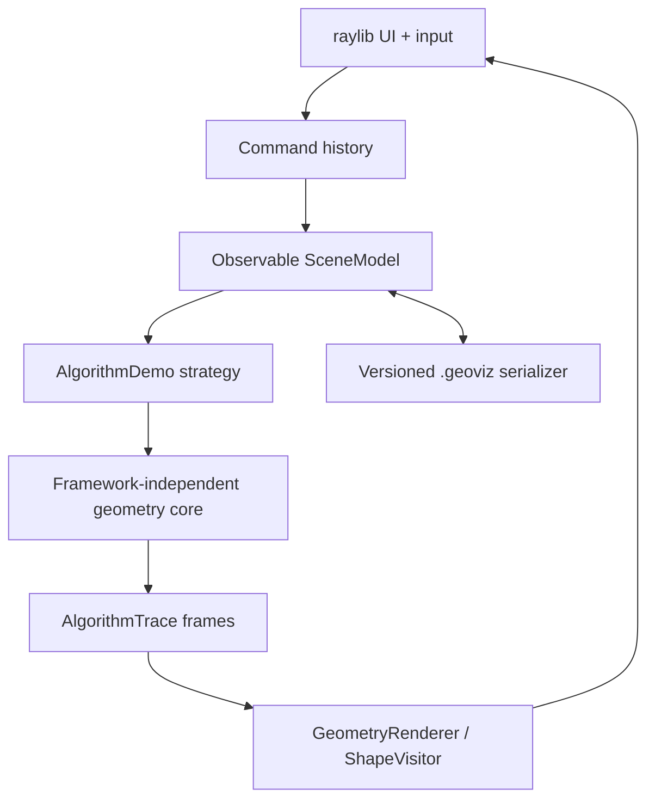

<div align="center">


### See the mathematics. Step through the algorithm. Move the geometry.

[](https://isocpp.org/)
[](https://www.raylib.com/)
[](.github/workflows/ci.yml)
[](LICENSE)
[](docs/PROJECT_REPORT.md)

**A native, interactive computational-geometry laboratory written entirely in modern C++.**

[Features](#algorithm-atlas) • [Build](#quick-start) • [Controls](#controls) • [Architecture](#architecture) • [OOP map](docs/OOP_FEATURE_MAP.md) • [Report](docs/PROJECT_REPORT.md)

</div>

---



> [!NOTE]
> GeoViz is a resizable desktop application—not a terminal visualizer and not a browser wrapper. Algorithms are isolated in a testable C++ core; raylib is used only by the presentation layer.

## Why GeoViz?

Computational geometry is much easier to understand when every orientation test, discarded edge, circumcircle, clipping constraint, and recursive split can be **seen**. GeoViz turns those decisions into deterministic animation frames that can be paused, replayed, and scrubbed while the input is edited live.

This project was created for:

| Field | Details |
|---|---|
| Student | **Satyam Dhal** |
| Roll number | **B425050** |
| Institution | **IIIT Bhubaneswar** |
| Branch | **CSE-B** |
| Semester | **3** |
| Subject | **Object Oriented Programming Lab** |

## Highlights

- Beautiful dark glass/neon UI with a mathematical grid, glow layers, responsive panels, and a distraction-free native window.
- Add, drag, and remove points; pan and zoom around the cursor; watch results update immediately.
- Four interchangeable convex-hull strategies implemented behind one polymorphic interface.
- Animated Bowyer–Watson Delaunay triangulation and viewport-clipped Voronoi cells with their dual overlaid.
- Playback controls: play, pause, previous/next, first/last, variable speed, narration, comparison counters, and colored legends.
- Undo/redo with the Command design pattern; observable scene model; versioned `.geoviz` save/load; drag-and-drop file loading.
- Framework-independent geometry core with no UI dependency, plus a dependency-free C++ regression suite.
- Pinned raylib release fetched automatically by CMake—no manual library copying.
- Rich academic documentation, architecture diagrams, viva questions, presets, CI, issue templates, and professional repository metadata.

## Algorithm atlas

The sidebar contains **14 interactive labs**. Each produces an `AlgorithmTrace` rather than drawing directly, separating mathematics from presentation.

| Category | Visual lab | Technique | Complexity shown in app |
|---|---|---|---:|
| Foundations | Point / Line / Ray | Shapes, vectors, distance, projection, orientation, circumcircle | `O(1)` per primitive |
| Convex hulls | Monotonic Chain | Lexicographic lower/upper scans | `O(n log n)` |
| Convex hulls | Graham Scan | Polar sort + turn stack | `O(n log n)` |
| Convex hulls | Jarvis March | Gift wrapping | `O(nh)` |
| Convex hulls | QuickHull | Farthest-point partitioning | average `O(n log n)` |
| Tessellation | Delaunay Triangulation | Incremental Bowyer–Watson | expected `O(n log n)` |
| Tessellation | Voronoi Diagram | Perpendicular-bisector half-plane clipping | visual construction `O(n³)` |
| Clipping | Half-Plane Intersection | Progressive convex clipping | `O(kv)` |
| Polygons | Ear Clipping | Empty convex ears | `O(n²)` |
| Proximity | Closest Pair | Divide and conquer + merge strip | `O(n log² n)` |
| Intersections | Segment Intersections | Robust orientation classification | `O(m²)` |
| Polygons | Point in Polygon | Boundary test + ray-crossing parity | `O(n)` |
| Proximity | Smallest Enclosing Circle | Deterministic incremental disk | `O(n³)` |
| Convex geometry | Rotating Calipers | Antipodal hull pairs | `O(n log n)` incl. hull |

The reusable core additionally provides circle–line/circle–circle intersections, transformations, centroids, polygon clipping, Minkowski sum, convex diameter, Douglas–Peucker simplification, projections, distances, and exact scene serialization. See [the algorithm notes](docs/ALGORITHMS.md).

## Supported geometry

| Primitive | Representation | Important operations |
|---|---|---|
| `Point` | Encapsulated finite `x, y` | vector arithmetic, equality tolerance, clone, visitor dispatch |
| `Vector2D` | Immutable displacement | normalization, scaling, perpendiculars, dot/cross |
| `Line` | anchor + unit direction | containment, projection, infinite intersection |
| `Ray` | origin + unit direction | non-negative parameterization, segment intersection |
| `Segment` | two endpoints | length, midpoint, bounds, overlap intersection |
| `Circle` | centre + radius | area, perimeter, containment, intersections |
| `Triangle` | three vertices | signed area, containment, circumcenter/circumcircle |
| `Polygon` | ordered vertex vector | area, perimeter, edges, bounds, containment |
| `HalfPlane` | oriented boundary | left-side feasibility predicate |

All drawable primitives implement the abstract `Shape` interface and accept a `ShapeVisitor`. Invalid objects throw a dedicated `GeometryError` rather than silently producing undefined results.

## Quick start

### Windows — MSYS2 UCRT64 (recommended)

GeoViz matches a modern MSYS2/GCC setup well. Open the **MSYS2 UCRT64** terminal and run:

```bash
pacman -S --needed mingw-w64-ucrt-x86_64-gcc \
  mingw-w64-ucrt-x86_64-cmake mingw-w64-ucrt-x86_64-ninja git

git clone https://github.com/b425050-prog/GeoViz.git
cd GeoViz
cmake --preset release
cmake --build --preset release
./build/release/GeoViz.exe
```

CMake first looks for an installed raylib 5.5 package. If it is absent, the pinned official source release is downloaded and built automatically.

### Windows — Visual Studio 2022

```powershell
git clone https://github.com/b425050-prog/GeoViz.git
cd GeoViz
cmake -S . -B build -G "Visual Studio 17 2022" -A x64
cmake --build build --config Release
./build/Release/GeoViz.exe
```

### Ubuntu / Debian

```bash
sudo apt update
sudo apt install build-essential cmake ninja-build git \
  libasound2-dev libx11-dev libxrandr-dev libxi-dev \
  libgl1-mesa-dev libglu1-mesa-dev libxcursor-dev libxinerama-dev

cmake --preset release
cmake --build --preset release
./build/release/GeoViz
```

### macOS

```bash
brew install cmake ninja git
cmake --preset release
cmake --build --preset release
./build/release/GeoViz
```

> [!TIP]
> For a fast algorithm-only build that does not download raylib, run `cmake --preset core-only`, `cmake --build --preset core-only`, then `ctest --test-dir build/core-only --output-on-failure`.

## Controls

| Input | Action |
|---|---|
| Left click | Add a point |
| Left drag | Move an existing point |
| Right click | Remove nearest point |
| Middle drag | Pan canvas |
| Mouse wheel | Zoom at cursor |
| `Space` | Play / pause trace |
| `←` / `→` | Previous / next frame |
| `R` | Load a demo-aware smart preset |
| `Home` | Reset pan and zoom |
| `Delete` | Clear canvas |
| `Ctrl+Z` / `Ctrl+Y` | Undo / redo |
| `Ctrl+S` / `Ctrl+O` | Save / load `geoviz_scene.geoviz` |
| `H` or `F1` | Open in-app quick guide |

The **Smart** toolbar preset understands the active input model. For example, it supplies a simple ordered polygon for ear clipping, paired endpoints for segment intersection, and consistently oriented boundaries for half-plane intersection.

## Architecture



The project deliberately uses dependency inversion: high-level demos depend on geometry interfaces, not on renderer details. A mathematical algorithm can be tested without opening a window, and a new renderer could consume the same trace. Read [ARCHITECTURE.md](docs/ARCHITECTURE.md) for the class design and extension workflow.

### Design patterns used

- **Strategy:** `ConvexHullStrategy` and `AlgorithmDemo` allow run-time algorithm selection.
- **Visitor:** `ShapeVisitor` renders heterogeneous shapes without raylib leaking into the domain layer.
- **Command:** undoable add, remove, move, and replace-scene operations.
- **Observer:** `SceneModel` invalidates algorithm traces after a mutation.
- **Factory:** `makeHullStrategy()` and `DemoRegistry` construct polymorphic implementations.
- **Model–View separation:** algorithms emit immutable visual frames instead of issuing draw calls.

Every requested OOP/C++ feature is mapped to a concrete class and file in [OOP_FEATURE_MAP.md](docs/OOP_FEATURE_MAP.md).

## Repository map

```text
GeoViz/
├── include/geoviz/
│   ├── geometry/       # Shape hierarchy and value objects
│   ├── algorithms/     # Predicates and computational geometry
│   ├── animation/      # Framework-independent visual frames
│   ├── app/            # Model, demos, commands, theme, renderer
│   └── io/             # Versioned scene serialization
├── src/                # Implementations and native entry point
├── tests/              # 12 regression suites, no test dependency
├── assets/             # GitHub media and ready-to-load presets
├── docs/               # Report, architecture, algorithms, viva guide
├── .github/            # CI and issue templates
├── CMakeLists.txt
└── CMakePresets.json
```

## Testing and quality

```bash
cmake --preset core-only
cmake --build --preset core-only
ctest --test-dir build/core-only --output-on-failure
```

The suite checks:

- polymorphic shape behavior and operator-overloaded vectors;
- orientation, projection, distance, and intersection degeneracies;
- identical square hulls from all four strategies;
- Delaunay triangle/edge topology and Voronoi cell area;
- half-plane feasibility and concave ear-clipping area conservation;
- closest pair, segment intersections, Minkowski sum, rotating calipers, simplification, and enclosing circle;
- Command-pattern undo/redo, serializer round trips, and safe traces for every registered demo.

CI builds and runs the core suite on Linux, Windows, and macOS. Compiler warnings are elevated in the dedicated core preset.

## Documentation

- [Project report](docs/PROJECT_REPORT.md) — submission-ready academic report.
- [OOP & C++ feature map](docs/OOP_FEATURE_MAP.md) — evidence for every important language feature.
- [Algorithm notes](docs/ALGORITHMS.md) — invariants, complexity, and degeneracy handling.
- [Architecture guide](docs/ARCHITECTURE.md) — layers, ownership, patterns, and extension points.
- [User guide](docs/USER_GUIDE.md) — inputs, presets, build help, and troubleshooting.
- [Viva questions](docs/VIVA_QUESTIONS.md) — focused answers for demonstration day.
- [Validation record](docs/VALIDATION.md) — strict compilation, sanitizers, stress checks, and media validation.

All public headers contain Doxygen comments. Run `doxygen Doxyfile` to generate a browsable API site under `docs/generated/html/`.

## Roadmap

- Fortune's sweep-line Voronoi construction.
- Bentley–Ottmann `O((n + k) log n)` segment sweep.
- Constrained Delaunay triangulation and polygon holes.
- 3-D predicates, meshes, and QuickHull.
- Export canvas frames as PNG/GIF directly from the app.

## Contributing

Thoughtful contributions are welcome. Read [CONTRIBUTING.md](CONTRIBUTING.md), keep the geometry core independent of raylib, add regression tests for degeneracies, and preserve the documented style.

## License and attribution

GeoViz source code is released under the [MIT License](LICENSE). It uses [raylib](https://github.com/raysan5/raylib), distributed under its own zlib/libpng license. Mathematical algorithms are implemented from their standard definitions; references are listed in the [project report](docs/PROJECT_REPORT.md).

<div align="center">

Built with geometry, curiosity, and modern C++ by **Satyam Dhal** · `B425050`

**IIIT Bhubaneswar · OOPS Lab · Semester 3 · CSE-B**

</div>
