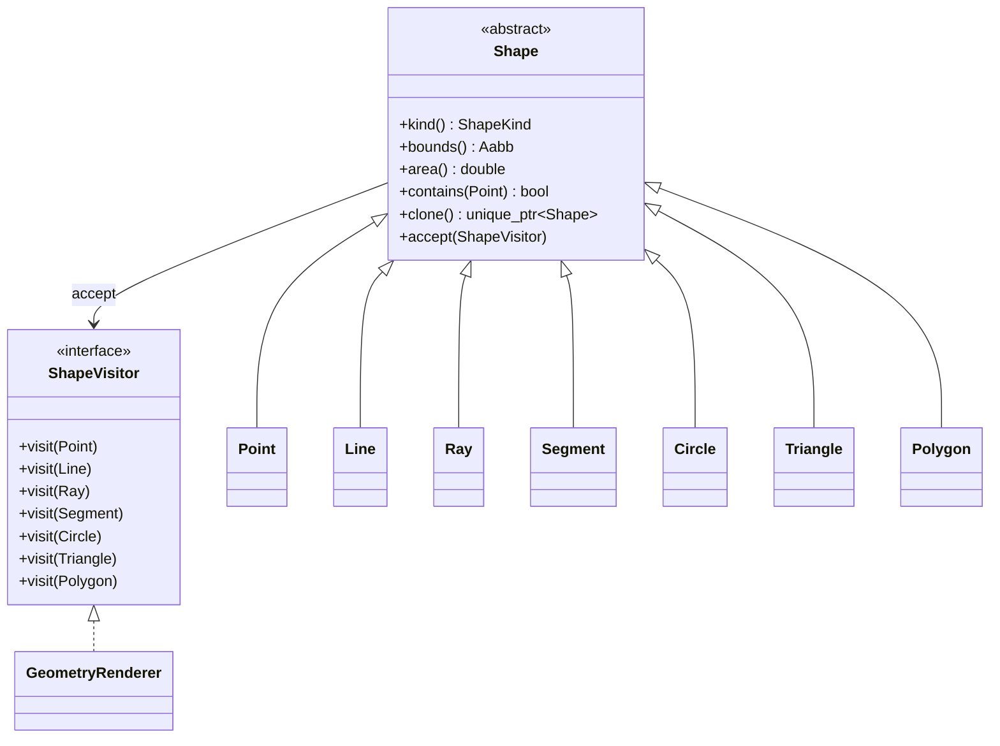
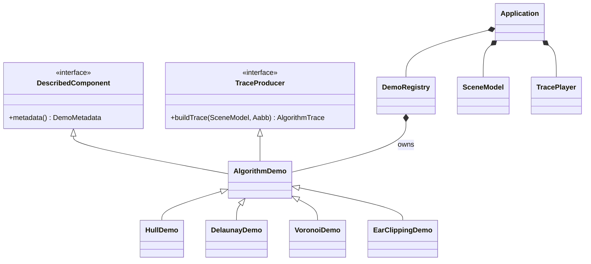
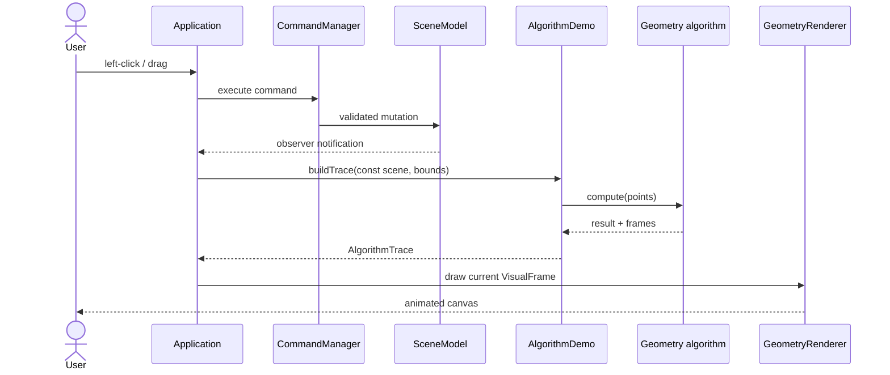

# GeoViz Architecture

## Design goals

GeoViz is organized around five goals:

1. Mathematical code must be testable without opening a window.
2. Algorithms must explain their decisions, not only return a final answer.
3. The graphical library must not leak into domain objects.
4. Input edits must be reversible and safely persisted.
5. Adding a new algorithm must require localized changes.

## Layered structure

| Layer | Main namespace | Responsibilities | Depends on raylib? |
|---|---|---|---:|
| Geometry model | `geoviz` | Shapes, vectors, bounds, validation, visitor contract | No |
| Algorithm core | `geoviz::algorithms` | Predicates, intersections, hulls, tessellation, clipping, proximity | No |
| Animation model | `geoviz` | Immutable visual frames and trace metadata | No |
| Application model | `geoviz::app` | Observable scene, commands, demo strategies, playback | No |
| Persistence | `geoviz::io` | Versioned `.geoviz` format | No |
| Presentation | `geoviz::app` | Canvas transform, ShapeVisitor renderer, panels, native input | Yes |

The dependency arrow always points inward toward stable domain code. Only `Theme.hpp`, `Renderer.hpp/.cpp`, `Application.hpp/.cpp`, and `main.cpp` include raylib.

## Principal class model





## One edit-to-pixel cycle



## Ownership and lifetime

| Object | Owner | Representation | Reason |
|---|---|---|---|
| Scene, registry, player, theme | `Application` | values | Fixed application-lifetime collaborators. |
| Shape clone | caller | `unique_ptr<Shape>` | Runtime type with exclusive ownership. |
| Registered demos | `DemoRegistry` | `vector<unique_ptr<AlgorithmDemo>>` | Heterogeneous polymorphic collection. |
| Hull strategy | demo/caller | `unique_ptr<ConvexHullStrategy>` | Selected factory result. |
| Commands | history stack | `unique_ptr<SceneCommand>` | Ownership moves between undo and redo. |
| Renderer dependencies | `Application` | const references | Non-owning aggregation; application outlives renderer. |
| Algorithm inputs | caller | `std::span<const T>` | Non-owning, bounds-aware read-only views. |
| Results and frames | caller | values and vectors | Clear ownership, cheap move transfer. |

There is no owning raw pointer and no manual `new`/`delete` in project code.

## Algorithm trace model

An algorithm returns its mathematical result and an `AlgorithmTrace`. A `VisualFrame` can contain:

- source and highlighted points;
- accepted, candidate, and rejected edges;
- triangles and translucent polygons;
- an optional guide circle;
- a headline, explanation, comparison count, and iteration number.

This is deliberately renderer-agnostic. Tests ignore frames when verifying output, while the UI consumes the same frames for animation. A future SVG or video renderer could reuse them unchanged.

## Numerical policy

- Geometry uses `double`; raylib conversion to `float` occurs only in `CanvasTransform`.
- `kEpsilon` is the base tolerance.
- `almostEqual` scales tolerance to operand magnitude.
- `orientation` scales the determinant threshold by vector length.
- Duplicate point removal occurs before hull and Delaunay construction.
- Parallel and collinear cases return explicit intersection kinds.
- Degenerate circumcenters return `std::nullopt`.
- Public constructors reject non-finite coordinates, zero directions, and negative radii.

For exact industrial geometry, adaptive/exact predicates would be the next improvement; see the project roadmap.

## Scene persistence

The serializer uses a small versioned text format:

```text
GEOVIZ 1
POINTS 2
10.0 20.0
-5.5 9.25
HALF_PLANES 1
0.0 0.0 1.0 0.0
```

Input counts are capped at 10,000 before allocation. Constructors revalidate every number, so corrupt values do not bypass domain invariants.

## Extending GeoViz

To add an algorithm named `ExampleAlgorithm`:

1. Define a result type and implementation under `algorithms/` using only core headers.
2. Record frames only at meaningful state transitions; do not call raylib.
3. Add normal, degenerate, and invariant tests.
4. Implement an `AlgorithmDemo` adapter and add it to `DemoRegistry`.
5. Add a smart preset if inputs are ordered, paired, or constrained.
6. Document invariant and complexity in `ALGORITHMS.md`.
7. The renderer and playback system require no changes unless a new visual primitive is truly necessary.

## Deliberate trade-offs

- Voronoi cells use repeated clipped half-planes instead of Fortune's sweep. This is slower but stable, compact, educational, and naturally handles unbounded cells inside the canvas.
- Half-plane intersection clips against finite visible bounds. The mathematical result may be unbounded, but an interactive renderer needs a finite polygon.
- Closest pair uses `O(n log² n)` because each recursive merge sorts its strip. Maintaining y-sorted subarrays would reduce it to `O(n log n)` at the cost of more teaching complexity.
- Segment intersection visualizes all exact pairwise tests. Bentley–Ottmann is listed as an extension.

