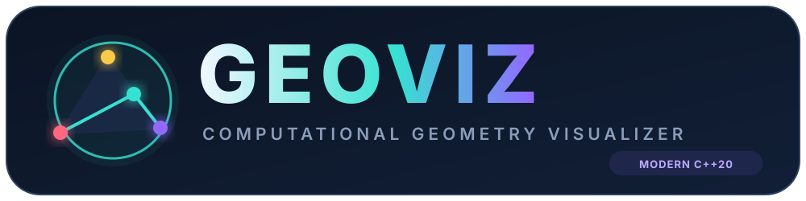
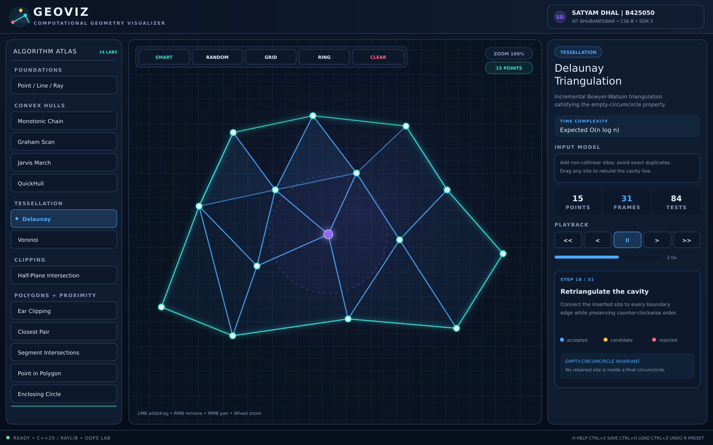
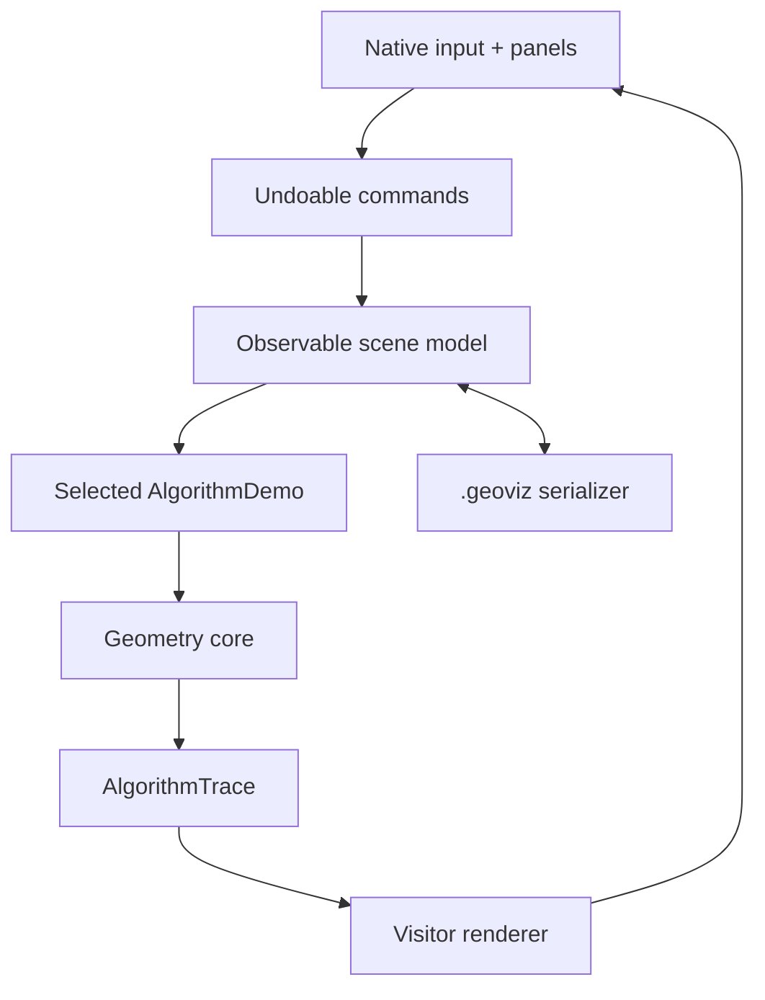

<div align="center">



# Project Report

## GeoViz — Computational Geometry Visualizer

### Object Oriented Programming Laboratory

**Submitted by**  
**Satyam Dhal**  
Roll No. **B425050**  
**CSE-B · Semester 3**

**International Institute of Information Technology Bhubaneswar**

Academic Session 2026–27

</div>

---

## Declaration

I, **Satyam Dhal (B425050)**, declare that the project titled **“GeoViz — Computational Geometry Visualizer”** is submitted as part of the Object Oriented Programming Laboratory for Semester 3, CSE-B, IIIT Bhubaneswar. The repository identifies third-party dependencies and references. The design, C++ integration, visual trace system, tests, and documentation form a cohesive academic software project.

## Abstract

Computational geometry algorithms are commonly taught through static diagrams or final-output programs. This hides the decisions that make the algorithms interesting: orientation tests, edge rejection, circumcircle conflicts, cavity reconstruction, recursive partitions, and half-plane clipping. GeoViz is a native C++20 desktop application that exposes those decisions as interactive animations.

The system supports fundamental geometric objects—points, vectors, lines, rays, segments, circles, triangles, polygons, and half-planes—and fourteen visual laboratories ranging from four convex-hull strategies to Delaunay triangulation, Voronoi diagrams, half-plane intersection, polygon triangulation, proximity problems, and intersection tests. Users can add, remove, and drag points; pan or zoom the mathematical canvas; replay frames; load demo-specific presets; undo and redo changes; and persist scenes.

The project emphasizes object-oriented design. An abstract `Shape` hierarchy encapsulates geometry, a Visitor decouples drawing, Strategy interfaces support interchangeable algorithms, Commands provide reversible editing, an Observer invalidates stale traces, and factories/registries own polymorphic objects with smart pointers. The mathematical core contains no graphical dependency and is tested by twelve independent regression suites.

## 1. Problem statement

Create a visually attractive, non-terminal C++ application that teaches basic and advanced computational geometry while demonstrating the major features of object-oriented programming and modern C++.

### 1.1 Difficulties addressed

- Static textbook figures do not show algorithm state transitions.
- Mixing drawing calls into algorithms makes mathematical code difficult to test.
- Geometry contains degeneracies such as duplicate, collinear, parallel, cocircular, and zero-length inputs.
- A large algorithm collection can become an unmaintainable switch statement.
- Interactive editing requires state consistency, reversible commands, and safe error recovery.

## 2. Objectives

1. Build a native, resizable graphical application entirely around C++ source code.
2. Model all important 2-D primitives with validated, reusable classes.
3. Animate meaningful algorithm decisions with concise narration.
4. Include foundational and advanced algorithms in one consistent interface.
5. Demonstrate encapsulation, abstraction, inheritance, polymorphism, templates, exceptions, STL, smart pointers, and file I/O through real requirements.
6. Separate domain, algorithm, application, persistence, and presentation concerns.
7. Verify mathematical invariants with automated tests.
8. Package the project as a professional, GitHub-ready repository.

## 3. Scope

### 3.1 Included primitives

`Point`, `Vector2D`, `Line`, `Ray`, `Segment`, `Circle`, `Triangle`, `Polygon`, `HalfPlane`, and `Aabb`.

### 3.2 Included visual laboratories

- Primitive Geometry Lab
- Monotonic Chain convex hull
- Graham Scan convex hull
- Jarvis March convex hull
- QuickHull
- Bowyer–Watson Delaunay triangulation
- Voronoi diagram with Delaunay dual
- Half-plane intersection
- Ear-clipping polygon triangulation
- Divide-and-conquer closest pair
- Segment intersections
- Point in polygon
- Smallest enclosing circle
- Rotating calipers diameter

### 3.3 Additional reusable routines

Line/segment/ray/circle intersections, projections and distances, rotation and reflection, centroid, Sutherland–Hodgman polygon clipping, Minkowski sum, Douglas–Peucker simplification, circumcenter, and geometric containment.

## 4. Requirements

### 4.1 Functional requirements

- The user shall select an algorithm at run time.
- The user shall add, drag, and remove points on a canvas.
- The system shall rebuild the selected algorithm when input changes.
- The system shall display accepted, candidate, and rejected geometry distinctly.
- The user shall control playback and speed.
- The system shall support algorithm-aware presets.
- Editing shall support undo and redo.
- Scenes shall be saved, loaded, and accepted through file drag-and-drop.
- Invalid inputs shall produce an explanatory visual state instead of terminating the program.

### 4.2 Non-functional requirements

- C++20 with professional naming and const-correctness.
- Cross-platform CMake build.
- Framework-independent mathematical core.
- Native window with responsive layout and no browser runtime.
- Explicit ownership and no manual memory management.
- Tests must run without the GUI dependency.
- Repository must include documentation, license, CI, media, and presets.

## 5. Technology selection

| Technology | Purpose | Rationale |
|---|---|---|
| C++20 | Entire application and algorithm implementation | Strong OOP support, templates, STL, performance, deterministic ownership. |
| raylib 5.5 | Window, input, and accelerated 2-D drawing | Small API, cross-platform, ideal for custom visualization tools. |
| CMake 3.20+ | Build and dependency configuration | Cross-platform presets and automatic pinned dependency retrieval. |
| CTest | Test discovery and execution | Integrates the standalone C++ regression executable. |
| GitHub Actions | Continuous integration | Verifies core behavior on Linux, Windows, and macOS. |

The raylib dependency remains behind the renderer/application boundary. It does not appear in shape or algorithm code.

## 6. System architecture





The key design decision is the `AlgorithmTrace`. Algorithms do not draw. They return their result plus semantic frames. This lets the same algorithm be tested headlessly, animated interactively, or rendered by another future backend.

## 7. Object-oriented design

### 7.1 Encapsulation and invariants

Coordinates and radii are private. Constructors reject non-finite values, negative radii, and zero-length directions. `SceneModel` exposes mutation operations instead of its vectors, then notifies registered observers.

### 7.2 Shape abstraction

`Shape` declares runtime kind, name, bounds, area, perimeter, containment, cloning, and visitor acceptance. Seven concrete shapes override this contract. A virtual destructor makes deletion through `unique_ptr<Shape>` safe.

### 7.3 Polymorphic algorithms

`ConvexHullStrategy` has four concrete implementations. `AlgorithmDemo` combines the `DescribedComponent` and `TraceProducer` pure interfaces using interface-only multiple inheritance. The sidebar sees only metadata and a trace-producing operation.

### 7.4 Visitor

`GeometryRenderer` implements `ShapeVisitor`. Each shape calls the appropriate `visit` overload, so raylib-specific drawing is absent from the domain model. This demonstrates double dispatch and the Open/Closed Principle.

### 7.5 Command and Observer

Editing actions store their inverse state. `CommandManager` moves exclusive ownership between undo and redo vectors. After execution, `SceneModel` notifies `Application`, which rebuilds the selected trace.

### 7.6 Generic programming

`BoundedValue<T>` is constrained with `std::totally_ordered` and keeps playback speed inside a valid range. `square(T)` uses a custom arithmetic concept and compile-time assertions. Algorithms also accept `std::span<const T>` and make extensive use of generic STL algorithms.

A complete evidence table appears in [OOP_FEATURE_MAP.md](OOP_FEATURE_MAP.md).

## 8. Algorithm implementation

### 8.1 Robust predicates

Orientation uses the 2-D cross product and a scale-aware tolerance. All higher algorithms reuse this predicate. Intersection results distinguish no intersection, one point, overlap, and two points.

### 8.2 Convex hull strategies

The four implementations share an interface but maintain independent invariants:

- Monotonic Chain keeps strict turns in lower/upper scans.
- Graham Scan keeps strict turns on a polar-ordered stack.
- Jarvis March chooses one supporting edge for each hull vertex.
- QuickHull recursively partitions around the farthest point.

Their tests run on the same square-plus-centre input and verify equal vertex count and area.

### 8.3 Delaunay and Voronoi

Bowyer–Watson starts with a super-triangle. Each inserted site removes all triangles whose circumcircles contain it, identifies single-occurrence cavity edges, and retriangulates. Voronoi cells are constructed as intersections of closer-than-neighbour half-planes clipped to the canvas. Delaunay edges are overlaid to show duality.

### 8.4 Polygon and proximity algorithms

Ear clipping normalizes polygon orientation and rejects blocked ears, including a point on an ear diagonal. Closest pair recursively splits by x and checks a y-sorted merge strip. The smallest enclosing circle incrementally promotes outside sites to one-, two-, or three-point boundary constraints. Rotating calipers checks antipodal convex-hull pairs.

Detailed invariants and formulas appear in [ALGORITHMS.md](ALGORITHMS.md).

## 9. User-interface design

The visual language uses deep navy surfaces, glass-like raised panels, cyan/violet accents, and amber/coral algorithm states. The layout contains:

- identity and project header;
- scrollable Algorithm Atlas;
- zoomable mathematical canvas with major/minor grid and glow;
- smart/random/grid/ring/clear toolbar;
- contextual inspector with description, complexity, input model, statistics, player, and narration;
- status strip and modal quick guide.

Accepted geometry is displayed in the active accent, candidates in amber, and rejected geometry in coral. Points have halos to remain visible over translucent cells and triangles.

## 10. Persistence and error handling

The `.geoviz` format begins with a magic word and version. Counts are validated before allocation and capped at 10,000. Domain constructors revalidate parsed values. File and geometry errors are caught at the application boundary and shown in a toast or explanatory trace frame.

## 11. Testing

The test executable uses no third-party testing framework. Twelve named suites cover:

1. vector arithmetic and shape polymorphism;
2. predicates, projections, and intersections;
3. all four hull strategies;
4. Delaunay topology;
5. Voronoi cell area and dual;
6. half-plane feasibility;
7. concave ear-clipping area conservation;
8. closest pair and segment intersections;
9. advanced polygon utilities;
10. command undo/redo;
11. serialization round trip; and
12. all fourteen polymorphic demo traces.

Expected output:

```text
[PASS] Vector arithmetic and shape polymorphism
[PASS] Predicates, projections, and intersections
...
[PASS] Polymorphic demo registry

12 passed, 0 failed.
```

The core was compiled with `-Wall -Wextra -Wpedantic -Werror` during validation. CI repeats builds on the three major desktop operating systems.

## 12. Results

The final system satisfies the primary requirements:

- a true graphical desktop application;
- all major 2-D primitives;
- a broad mix of foundational and advanced geometry;
- deterministic step-by-step playback;
- professional modern C++ organization;
- visible use of the four OOP pillars and multiple design patterns;
- portable builds, tests, persistence, documentation, and repository media.

The separation between result and visualization is the most important outcome. Mathematical code remains reusable while the UI can make it expressive.

## 13. Limitations

- Floating-point predicates are tolerant but not exact/adaptive.
- Voronoi uses a clear clipped-cell construction rather than Fortune's optimal sweep.
- Segment intersections use pairwise testing instead of Bentley–Ottmann.
- Ear clipping supports a simple polygon without holes.
- The canvas is 2-D; no mesh or 3-D geometry is included.

These limitations are documented rather than hidden, and each has a direct extension path.

## 14. Future work

- Adaptive exact orientation and in-circle predicates.
- Fortune sweep-line Voronoi and Bentley–Ottmann intersections.
- Constrained Delaunay triangulation, polygon holes, and Boolean operations.
- Spatial indexing with k-d trees, range trees, and R-trees.
- Direct screenshot/GIF export and recorded tutorial mode.
- 3-D point clouds, meshes, and QuickHull.
- Benchmark panel comparing observed operations and theoretical complexity.

## 15. Conclusion

GeoViz demonstrates that an OOP laboratory project can be both academically explicit and practically useful. Its shape hierarchy, visitor renderer, polymorphic algorithms, command history, observer model, constrained templates, exception-safe persistence, and regression suite are not isolated textbook examples; each solves a real requirement of the visualizer. The application turns abstract geometry into an interactive learning experience while preserving clean, testable C++ architecture.

## References

1. Mark de Berg, Otfried Cheong, Marc van Kreveld, and Mark Overmars, *Computational Geometry: Algorithms and Applications*, Springer.
2. Thomas H. Cormen, Charles E. Leiserson, Ronald L. Rivest, and Clifford Stein, *Introduction to Algorithms*, MIT Press.
3. Franco P. Preparata and Michael Ian Shamos, *Computational Geometry: An Introduction*, Springer.
4. Joseph O'Rourke, *Computational Geometry in C*, Cambridge University Press.
5. raylib project, [official repository](https://github.com/raysan5/raylib) and [website](https://www.raylib.com/).
6. ISO C++ reference material, [cppreference](https://en.cppreference.com/).

